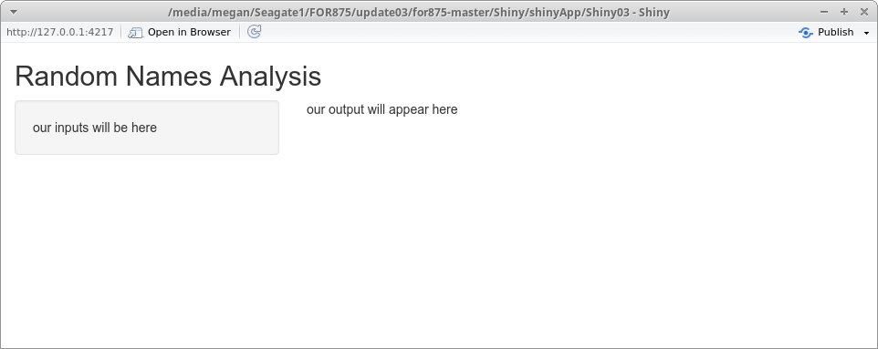

<!-- Need to fix table and the bizarre code at the end -->

# Shiny

[Shiny](https://shiny.rstudio.com/) is a framework that turns R code and figures into interactive web applications. Let's start out by looking at a built-in example Shiny app. 

```{r, echo = FALSE, eval = FALSE}
library(shiny)
runExample("01_hello")
```

In the bottom panel of the resulting Shiny app (Figure \@ref(fig:hello)), we can see the R script that is essential to running any Shiny app: `app.R`. Take a minute to explore how the app works and how the script code is structured. The first part of the script (`ui <-`) defines the app's user interface (UI) using directives that partition the resulting web page and placement of input and output elements. The second part of the script defines a function called `server` with arguments `input` and `output`. This function provides the logic required to run the app (in this case, to draw the histogram of the Old Faithful Geyser Data). Third, `ui` and `server` are passed to a function called `shinyApp` which creates the application.^[Since 2014, Shiny has supported single-file applications (one file called app.R that contains UI and server components), but in other resources, you may see two separate source files, `server.R` and `ui.R`, that correspond to those two components. We will use the updated one-file system here, but keep in mind that older resources you find on the internet using the Shiny package may employ the two-file approach. Ultimately, the code inside these files is almost identical to that within the single `app.R` file. See [here](https://shiny.rstudio.com/articles/app-formats.html) for more information.]

```{r hello, fig.cap = "Hello Shiny example app", echo = FALSE}
knitr::include_graphics("../../for875-19/figures/hello_shiny.png")
```

All of the example code and data for the remainder of this chapter can be accessed using the following code.

```{r, prompt=FALSE}
library(downloader)

download("http://blue.for.msu.edu/FOR875/data/shiny_chapter_code.zip", 
         destfile="./shiny_chapter_code.zip", mode="wb")

unzip("shiny_chapter_code.zip", exdir = ".")
```

## Running a Simple Shiny App

Shiny apps allow users to interact with a data set. Let's say we have access to a dummy data set `name_list.csv`. Begin by taking a quick look at what this CSV file contains.

```{r, prompt=FALSE}
namesDF <- read.csv("http://blue.for.msu.edu/FOR875/data/name_list.csv", 
                    stringsAsFactors = FALSE)
str(namesDF)
```

Given the `namesDF` data, our goal over the next few sections is to develop a Shiny application that allows users to explore age distributions for males and females. We begin by defining a very basic Shiny application script upon which we can build the desired functionality. The script file that defines this basic application is called `app.R` and is provided in the code block below called "version 1". Follow the subsequent steps to create and run this Shiny app (note these steps are already done for you in the "ShinyPractice" directory in "shiny_chapter_code.zip", but you might want to do it yourself):

1. Create a new directory called "ShinyPractice".
2. In the "ShinyPractice" directory, create a blank R script called `app.R`. 
3. Copy the code in "app.R version 1" into `app.R`.
4. Run the Shiny app from RStudio. There are two ways to do this: 1) use the RStudio button (See Figure \@ref(fig:fig1)) or; 2) type the function `runApp()` in the RStudio console.

```{r, prompt=FALSE}
# app.R version 1

library(shiny)

names.df <- read.csv("http://blue.for.msu.edu/FOR875/data/name_list.csv")

# Define UI
ui <- fluidPage(
  
  titlePanel("Random Names Analysis"),
  
  sidebarLayout(
    
    sidebarPanel("our inputs will be here"),
    
    mainPanel("our output will appear here")
  )
)

# Define server logic
server <- function(input, output) {}

# Create Shiny app
shinyApp(ui = ui, server = server)
```


```{r fig1, fig.cap = "Running a Shiny app locally", echo = FALSE}
knitr::include_graphics("../figures/RStudio_runApp.png")
```

If everything compiles correctly, you should get a window that looks like Figure \@ref(fig:fig2). There are a few things to notice. First, we read in the CSV file at the beginning of the `app.R` script so that these data can be accessed in subsquent development steps (although we don't use it yet in this initial application). Second, our Shiny app is not interactive yet because there is no way for a user to input any data---the page is view-only. Third, the function `function(input,output) {}` in `app.R` does not include any code, reflecting that we are not yet using any user inputs or creating any outputs. 

```{r fig2, fig.cap = "Your first Shiny app"}

```

## Adding User Input

Shiny package widgets are used to collect user provided inputs (visit the [Shiny Widget Gallery](https://shiny.rstudio.com/gallery/widget-gallery.html) to get a sense of the different kinds of input dialogues). In the subsequent development we'll use slider bars, dropdown menus, and check boxes. All widget functions, at minimum, include an `inputId` and `label` argument. The character string assigned to the `inputId` argument will be the variable name used to access the value(s) selected or provided by the user. This variable name is used in the application development and not seen by the user.  The character string assigned to the `label` argument appears in the UI above the given input widget and serves to provide a user-friendly description of the desired input.

Building on the "version 1" code, we add a dropdown menu to the script's UI portion using the `selectInput` function to the "version 2" code below. Update `app.R` and rerun the application. What is our `inputId` for the dropdown menu? What is our `label`? Can you see where the `label` is displayed in the app when you rerun it?

Look at the structure of the `choices` argument in `selectInput`. It's a vector of options in the form `"name" = "value"` where the `name` is what the user sees, and the `value` is what is returned to the server logic function of the `app.R` file.

```{r, prompt=FALSE, eval=F}
# app.R version 2

library(shiny)

names.df <- read.csv("http://blue.for.msu.edu/FOR875/data/name_list.csv")

# Define UI
ui <- fluidPage(
  titlePanel("Random Names Age Analysis"),
  sidebarLayout(
    sidebarPanel(
      # Dropdown selection for Male/Female
      selectInput(inputId = "sexInput", label = "Sex:",
                  choices = c("Female" = "F", 
                              "Male" = "M", 
                              "Both" = "B"))
    ),
    mainPanel("our output will appear here")
  )
)

# Define server logic
server <- function(input, output) {}

# Create Shiny app
shinyApp(ui = ui, server = server)
```


## Adding Output

Now that we've included the user input dialog, let's make the application truly interactive by changing the output depending on user input. This is accomplished by modifying the server logic portion of the script. Our goal is to plot an age distribution histogram in the main panel given the sex selected by the user.

### Interactive Server Logic

Server logic is defined by two arguments: `input` and `output`. These objects are both list-like, so they can contain multiple other objects. We already know from the user input part of the `app.R` script that we have an input component called `sexInput`, which can be accessed in the reactive portion of the server logic by calling `input$sexInput` (notice the use of the `$` to access the input value associated with `sexInput`). In "version 3" of the application, we use the information held in `input$sexInput` to subset `names.df` then create a histogram of `names.df$Age`. This histogram graphic is included as an element in the `output` object and ultimately made available in the UI portion of the script by referencing its name `histogram`.

Reactive portions of our `app.R` script's server logic are inside the server function. We create reactive outputs using Shiny's functions like `renderPlot`.^[Every reactive output function's name in Shiny is of the form `render*`.] Obviously, `renderPlot` renders the contents of the function into a plot object; this is then stored in the `output` list wherever we assign it (in this case, `output$histogram`). Notice the contents of the `renderPlot` function are contained not only by regular parentheses, but also by curly brackets (just one more piece of syntax to keep track of).

```{r, prompt=FALSE}
# app.R version 3

library(shiny)

names.df <- read.csv("http://blue.for.msu.edu/FOR875/data/name_list.csv")

# Define UI
ui <- fluidPage(
  titlePanel("Random Names Age Analysis"),
  sidebarLayout(
    sidebarPanel(
      # Dropdown selection for Male/Female
      selectInput(inputId = "sexInput", label = "Sex:",
                  choices = c("Female" = "F", 
                              "Male" = "M", 
                              "Both" = "B"))
    ),
    mainPanel("our output will appear here")
  )
)

# Define server logic
server <- function(input, output) {

  output$histogram <- renderPlot({
    
    if(input$sexInput != "B"){
      subset.names.df <- subset(names.df, Sex == input$sexInput)
    } else {
      subset.names.df <- names.df
    }
    
    ages <- subset.names.df$Age
    
    # draw the histogram with the specified 20 bins
    hist(ages, col = 'darkgray', border = 'white')
  })

}

# Create Shiny app
shinyApp(ui = ui, server = server)

```

Update your `app.R` server logic function to match the code above. Rerun the application. Note the appearance of the app doesn't change because we have not updated the UI portion with the resulting histogram.

### Interactive User Interface

Now we update the UI part of `app.R` to make the app interactive. In the "version 4" code below, the `plotOutput("histogram")` function in `ui` accesses the `histogram` component of the `output` list and plots it in the main panel. Copy the code below and rerun the application. You have now created your first Shiny app!

```{r, prompt=FALSE,eval=F}
# app.R version 4

library(shiny)

names.df <- read.csv("http://blue.for.msu.edu/FOR875/data/name_list.csv")

# Define UI
ui <- fluidPage(
  titlePanel("Random Names Age Analysis"),
  sidebarLayout(
    sidebarPanel(
      # Dropdown selection for Male/Female
      selectInput(inputId = "sexInput", label = "Sex:",
                  choices = c("Female" = "F", 
                              "Male" = "M", 
                              "Both" = "B"))
    ),
    mainPanel(plotOutput("histogram"))
  )
)

# Define server logic
server <- function(input, output) {

  output$histogram <- renderPlot({

    if(input$sexInput != "B"){
      subset.names.df <- subset(names.df, Sex == input$sexInput)
    } else {
      subset.names.df <- names.df
    }
    
    ages <- subset.names.df$Age
    
    # draw the histogram with the specified 20 bins
    hist(ages, col = 'darkgray', border = 'white')
  })

}

# Create Shiny app
shinyApp(ui = ui, server = server)

```

## More Advanced Shiny App: Michigan Campgrounds

The Michigan Department of Natural Resources (DNR) has made substantial investments in open-sourcing its data via the [Michigan DNR's open data](http://gis-midnr.opendata.arcgis.com/datasets/) initiative. We'll use some of these data to motivate our next Shiny application. Specifically we'll work with the DNR State Park Campgrounds data available [here](http://blue.for.msu.edu/FOR875/data/Michigan_State_Park_Campgrounds.csv) as a CSV file.

```{r}
u <- "http://blue.for.msu.edu/FOR875/data/Michigan_State_Park_Campgrounds.csv"
sites <- read.csv(u, stringsAsFactors = F)
str(sites)
```

We see that Michigan has 151 state park campgrounds, and our data frame contains 19 variables. Let's create a Shiny app UI in which the user selects desired campground specifications, and the app displays the list of resulting campgrounds and their location on a map. The complete Shiny `app.R` is provided in the "CampsitesMI" directory in "shiny_chapter_code.zip." Start out by running the application to see how it works. Examine the example code and how it relates to the application that you are running. The following sections detail each of the app's components.

### Michigan Campgrounds UI

First, let's look at the structure of the page. Similar to our first application, we again use a `fluidPage` layout with title panel and sidebar. The sidebar contains a sidebar panel and a main panel. Our sidebar panel has three user input widgets:

+ `sliderInput`: Allows user to specify a range of campsites desired in their campground. Since the maximum number of campsites in any Michigan state park campground is 411, 420 was chosen as the maximum.
+ `selectInput`: Allows user to select what type of campsites they want. To get the entire list of camp types, we used the data frame, `sites`, loaded at the beginning of the script.
+ `checkboxInput`: Allows the user to see only campgrounds with ADA sites available.

Table \@ref{tab:els} provides a list of the various input and output elements.  Take your time and track how the app defines then uses each input and output.
\begin{table}[]
\centering
\caption{Interactive elements}
\label{table:els}
\begin{tabular}{lll}
\hline
\multicolumn{1}{c}{\textbf{Element ID}} & \multicolumn{1}{c}{\textbf{Description}} & \multicolumn{1}{c}{\textbf{Function to Create}} \\ \hline
input\$rangeNum                         & desired range of campsite quantity       & sliderInput                                     \\
input\$type                             & desired campsite type                    & selectInput                                     \\
input\$ada                              & desired ADA site availability            & checkboxInput                                   \\
output\$plot1                           & map with campground markers              & renderPlot                                      \\
output\$text1                           & HTML-formatted list of campgrounds       & renderText                                      \\ \hline
\end{tabular}
\end{table}

### Michigan Campgrounds Server Logic

In creating our `server` variable, we have two functions that fill in our output elements:

+ `renderText`: Creates a character string of HTML code to print the bulleted list of available sites.
+ `renderPlot`: Creates a `ggplot2` map of Michigan with campground markers.

Note that both of these functions contain identical subsetting of the `sites` data frame into the smaller `sites1` data frame (see below). As you can see from the code, we use the three inputs from the application to subset the data: `rangeNum` from the slider widget, `type` from the dropdown menu, and `ada` from the checkbox.

This repeated code can be avoided using Shiny's reactive expressions. These expressions will update in value whenever the widget input values change. See [here](https://shiny.rstudio.com/tutorial/written-tutorial/lesson6/) for more information. The use of reactive expressions is beyond the scope of this chapter, but it is an important concept to be familiar with if you plan to regularly create Shiny applications. 

```{r, eval=FALSE,prompt=FALSE, tidy = FALSE}
sites1 <- subset(sites, 
                  TOTAL_SITE >= input$rangeNum[1] &  
                  TOTAL_SITE <= input$rangeNum[2] &  
                  Camp_type == input$type &   
                  if(input$ada){ ADA_SITES > 0 } else {ADA_SITES >= 0}
                )
```

## Adding Leaflet to Shiny

[Leaflet](https://rstudio.github.io/leaflet) can be easily incorporated in Shiny apps (See Chapter \@ref(sp) of this text to learn more about spatial data). In the Michigan Campgrounds example code, we used `plotOutput` and `renderPlot` to put a plot widget in our Shiny app. Similarly, in this code, we will use `leafletOutput` and `renderLeaflet` to add Leaflet widgets to our app. Run the Shiny app in the `CampsitesMI_Leaflet` directory. What are the differences between the plot widget in this app and the plot widget in the previous app (using `ggplot2`)?

{\makeatletter
% Switch catcode for % to other
\newcommand{\rtext}{%
  \catcode`\%=12
  \@rtext}
% Switch catcode for % back to comment character
\newcommand{\@rtext}[1]{\texttt{\detokenize{#1}}\catcode`\%=14}
\makeatother

Our code inside `renderLeaflet` is displayed below. As a reminder from our previous use of Leaflet, we can use the `magrittr` package's pipe operator, `%>%`, to add properties to our Leaflet plot.
In the `addCircleMarkers` function, you can see that we used the `mapply` function to apply HTML code to each of the markers. The HTML code simply prints the site name and number of sites within each marker label. The `else` statement serves the purpsose that if our subset, `sites1`, is empty, we render a map centered on Lansing, MI.

}

```{r, eval=FALSE,prompt=FALSE}
# renderLeaflet function from app.R

output$plot1 <- renderLeaflet({
    # create a subset of campsites based on inputs
    sites1 <- subset(sites, 
                    TOTAL_SITE >= input$rangeNum[1] & 
                      TOTAL_SITE <= input$rangeNum[2] & 
                      Camp_type == input$type & 
                      if(input$ada){ ADA_SITES > 0 } else {ADA_SITES >= 0})
    
    if(nrow(sites1) > 0){
      leaflet(sites1) %>% addTiles()  %>% 
        addCircleMarkers(lng = ~Long, lat = ~Lat, 
                         radius = 5,
                         color = "red",
                         label = mapply(function(x,y) {
                           HTML(sprintf('<em>%s</em><br>%s site(s)', 
                                        htmlEscape(x), 
                                        htmlEscape(y)))}, 
                           sites1$FACILITY, sites1$TOTAL_SITE
                           )
                         )
    } else {
        leaflet() %>% addTiles() %>%
        setView( -84.5555, 42.7325,   zoom = 7)
    }
    
  })
```

## Why use Shiny?

In this chapter, we learned what a Shiny app is, what it's components are, how to run the app, and how to incorporate Leaflet plots. We can also host these apps online on our own server or the [shinyapps.io](https://www.shinyapps.io/) server, which can be accessed directly from RStudio. Hosting our apps on a server allows anyone with internet access to interact with our widgets.

The shinyapps.io server allows free hosting of apps within the monthly limits of 5 applications and 25 active hours. Paid plans are also available. A user guide to deploying your application on shinyapps.io is available [here](http://docs.rstudio.com/shinyapps.io/index.html). Set up a free account and impress your friends by sending them links to your Shiny apps! In addition to hosting your applications, here are a few more things to discover with Shiny:

+ [Dive deeper](https://shiny.rstudio.com/tutorial/}) into development by working through the RStudio Shiny tutorial series.
+ [Incorporate](https://shiny.rstudio.com/articles/css.html) CSS stylesheets to make your apps fancier.
+ [Explore](https://shiny.rstudio.com/articles/single-file.html) the single-file Shiny app structure.

## Homework

**Exercise Shiny** Learning objectives: practice updating `ggplot2` plot aesthetics; modify Shiny HTML output; add an interactive Shiny element.
