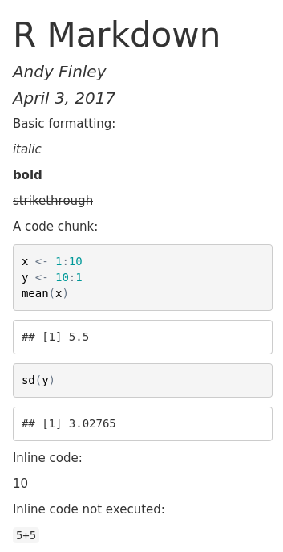

# Scripts and R Markdown

Doing work in data science, whether for homework, a project for a business, or a research project, typically involves several iterations. For example creating an effective graphical representation of data can involve trying out several different graphical representations, and then tens if not hundreds of iterations when fine-tuning the chosen representation. Furthermore, each of these representations may require several R commands to create. Although this all could be accomplished by typing and re-typing commands at the R Console, it is easier and more effective to write the commands in a *script file*, which then can be submitted to the R console either a line at a time or all together.^[Unsurprisingly it is also possible to submit several selected lines of code at once.] 

In addition to making the workflow more efficient, R scripts provide another large benefit. Often we work on one part of a homework assignment or project for a few hours, then move on to something else, and then return to the original part a few days, months, or sometimes even years later. In such cases we may have forgotten how we created the graphical display that we were so proud of, and will need to again spend a few hours to recreate it. If we save a script file, we have the ingredients immediately available when we return to a portion of a project.^[In principle the R history mechanism provides a similar record. But with history we have to search through a lot of other code to find what we're looking for, and scripts are a much cleaner mechanism to record our work.]

Next consider the larger scientific endeavor. Ideally a scientific study will be reproducible, meaning that an independent group of researchers (or the original researchers) will be able to duplicate the study. Thinking about data science, this means that all the steps taken when working with the data from a study should be reproducible, from the selection of variables to formal data analysis. In principle, this can be facilitated by explaining, in words, each step of the work with data. In practice, it is typically difficult or impossible to reproduce a full data analysis based on a written explanation. Much more effective is to include the actual computer code which accomplished the data work in the report, whether the report is a homework assignment or a research paper. Tools in R such as *R Markdown* facilitate this process. 

## Scripts in R

As noted above, scripts help to make work with data more efficient and provide a record of how data were managed and analyzed. Below we describe an example. This example uses features of R that we have not yet discussed, so don't worry about the details, but rather about how it motivates the use of a script file. 

First we read in a data set containing data on (among other things) fertility rate and life expectancy for countries throughout the world, for the years 1960 through 2014. 

```{r}
u <- "http://blue.for.msu.edu/FOR875/data/WorldBank.csv"
WorldBank <- read.csv(u, header=TRUE, stringsAsFactors=FALSE)
```

Next we print the names of the variables in the data set. Don't be concerned about the specific details. Later we will learn much more about reading in data and working with data sets in R.

```{r}
names(WorldBank)
```

We will try to create a scatter plot of fertility rate versus life expectancy of countries for the year 1960. To do this we'll first create variables containing the values of fertility rate and life expectancy for 1960^[This isn't necessary, but it is convenient], and print out the first ten values of each variable.

```{r}
fertility <- WorldBank$fertility.rate[WorldBank$year == 1960]
lifeexp <- WorldBank$life.expectancy[WorldBank$year==1960]
fertility[1:10]
lifeexp[1:10]
```

We see that some countries do not have data for 1960. R represents missing data via `NA`. Of course at some point it would be good to investigate which countries' data are missing and why. The `plot()` function in R will just omit missing values, and for now we will just plot the non-missing data. A scatter plot of the data is drawn next.

```{r}
plot(lifeexp, fertility)
```

The scatter plot shows that as life expectancy increases, fertility rate tends to decrease in what appears to be a nonlinear relationship. Now that we have a basic scatter plot, it is tempting to make it more informative. We will do this by adding two features. One is to make the points' size proportional to the country's population, and the second is to make the points' color represent the region of the world the country resides in. We'll first extract the population and region variables for 1960.

```{r}
pop <- WorldBank$population[WorldBank$year==1960]
region <- WorldBank$region[WorldBank$year==1960]
pop[1:10]
region[1:10]
```

To create the scatter plot we will do two things.  First we will create the axes, labels, etc. for the plot, but not plot the points. The argument `type="n"` tells R to do this. Then we will use the `symbols()` function to add symbols, the `circles` argument to set the sizes of the points, and the `bg` argument to set the colors. Don't worry about the details! In fact, later in the book we will learn about an R package called
 `ggplot2` that provides a different way to create such plots. You'll see two plots below, first the "empty" plot which is just a building block, then the plot including the appropriate symbols.
 
```{r, tidy = FALSE}
plot(lifeexp, fertility, type="n")
symbols(lifeexp, fertility, circles=sqrt(pop/pi), inches=0.35, 
        bg=match(region, unique(region)))
```

Of course we should have a key which tells the viewer which region each color represents, and a way to determine which country each point represents, and a lot of other refinements. For now we will resist such temptations. 

Some of the process leading to the completed plot is shown above, such as reading in the data, creating variables representing the 1960 fertility rate and life expectancy, an intermediate plot that was rejected, and so on. A lot of the process isn't shown, simply to save space. There would likely be mistakes (either minor typing mistakes or more complex errors). Focusing only on the `symbols()` function that was used to add the colorful symbols to the scatter plot, there would likely have been a substantial number of attempts with different values of the `circles`, `inches`, and `bg` arguments before settling on the actual form used to create the plot. This is the typical process you will soon discover when producing useful data visualizations. 

Now imagine trying to recreate the plot a few days later. Possibly someone saw the plot and commented that it would be interesting to see some similar plots, but for years in the 1970s when there were major famines in different countries of the world. If all the work, including all the false starts and refinements, were done at the console, it would be hard to sort things out and would take longer than necessary to create the new plots. This would be especially true if a few months had passed rather than just a few days.

But with a script file, especially a script file with a few well-chosen comments, creating the new scatter plots would be much easier. Fortunately it is quite easy to create and work with script files in RStudio.^[It is also easy in R without RStudio. Just use `File > New script` to create a script file, and save it before exiting R.] Just choose `File > New File > R script` and a script window will open up in the upper left of the full RStudio window. 

An example of a script window (with some R code already typed in) is shown in Figure \@ref(fig:script). From the script window the user can, among other things, save the script (either using the `File` menu or the icon near the top left of the window) and run one or more lines of code from the window (using the `run` icon in the window, or by copying and pasting into the console window). In addition, there is a `Source on Save` checkbox. If this is checked, the R code in the script window is automatically read into R and executed when the script file is saved.

```{r script, fig.cap = "A script window in RStudio"}
knitr::include_graphics("../figures/ScriptWindow.PNG")
```

## R Markdown

People typically work on data with a larger purpose in mind. Possibly the purpose is to understand a biological system more clearly. Possibly the purpose is to refine a system that recommends movies to users in an online streaming movie service. Possibly the purpose is to complete a homework assignment and demonstrate to the instructor an understanding of an aspect of data analysis. Whatever the purpose, a key aspect is communicating with the desired audience, for example, fellow researchers or an instructor. 

One possibility, which is somewhat effective, is to write a document using software such as Microsoft Word^[Or possibly LaTeX if the document is more technical] and to include R output such as computations and graphics by cutting and pasting into the main document. One drawback to this approach is similar to what makes script files so useful: If the document must be revised it may be hard to unearth the R code that created graphics or analyses.^[Organizing the R code using script files and keeping all the work organized in a well-thought-out directory structure can help here, but this requires a level of forethought and organization that most people do not possess$\ldots$including myself.] A more subtle but possibly more important drawback is that the reader of the document will not know precisely how analyses were done, or how graphics were created. And over time even the author(s) of the paper will forget the details. A verbal description in a "methods" section of a paper can help here, but typically these do not provide all the details of the analysis, but rather might state something like, "All analyses were carried out using R version 3.6.0."

RStudio's website provides an excellent overview of R Markdown capabilities for reproducible research. At minimum, follow the `Get Started` link at http://rmarkdown.rstudio.com/ and watch the introduction video.

Among other things, R Markdown provides a way to include R code that reads in data, creates graphics, or performs analyses. This is performed in a single document which is processed to create a research paper, homework assignment, or other written product. The R Markdown file is a plain text file containing text the author wants to have shown in the final document, simple commands to indicate how the text should be formatted (i.e. boldface, italic, or a bulleted list), and R code which creates output (including graphics) on the fly. Perhaps the simplest way to get started is to see an R Markdown file and the resulting document that is produced after the R Markdown document is processed.  Below we code that would comprise a very simple R Markdown file, and Figure \@ref(fig:rmdOut) shows the resulting output. In this case the output created is an HTML file, but there are other possible output formats such as Microsoft Word or PDF.

```
---
title: "R Markdown"
author: "Andy Finley"
date: "April 3, 2017"
output: html_document
---

Basic formatting:

*italic*

**bold**

~~strikethrough~~

```

A code chunk:

````
```{r}`r ''`
x <- 1:10
y <- 10:1
mean(x)
sd(y)
```
````
Inline code:

`` `r
5+5` ``

Inline code not executed:

`` `5+5` ``

```{r rmdOut, echo = FALSE, fig.cap = "Output from the above R Markdown code"}

```

At the top of the input R Markdown file are some lines with `---` at the top and bottom. These lines are not needed, but give a convenient way to specify the title, author, and date of the article that are then typeset prominently at the top of the output document. For now, don't be concerned with the lines following `output:`. These can be omitted (or included as shown).

Next are a few lines showing some of the ways that font effects such as italics, boldface, and strikethrough can be achieved. For example, an asterisk before and after text sets the text in *italics*, and two asterisks before and after text sets the text in *boldface*. 

More important for our purposes is the ability to include R code in the R Markdown file, which will be executed with the output appearing in the output document. Bits of R code included this way are called *code chunks*. The beginning of a code chunk is indicated with three backticks and an "r" in curly braces: `` ```{r} ``. The end of a code chunk is indicated with three backticks: `` ``` ``. For example, the R Markdown file described above has one code chunk:

````
```{r}`r ''`
x <- 1:10
y <- 10:1
mean(x)
sd(y)
```
````

In this code chunk two vectors `x` and `y` are created, and the mean  of `x` and the standard deviation of `y` are computed. In the output in Figure \@ref(fig:rmdOut) the R code is reproduced, and the output of the two lines of code asking for the mean and standard deviation is shown.

### Creating and Processing R Markdown Documents

RStudio has features which facilitate creating and processing R Markdown documents. Choose `File > New File > R  Markdown...`. In the ensuing dialog box make sure that `Document` is highlighted on the left, enter the title and author (if desired), and choose the Default Output Format (HTML is good to begin). Then click OK. A document will appear in the upper left of the RStudio window. It is an R Markdown document, and the title and author you chose will show up, delimited by `---` at the top of the document. A generic body of the document will also be included. 

For now just keep this generic document as is. To process it to create the HTML output, click the `Knit HTML` button at the top of the R Markdown window. You'll be prompted to choose a filename for the R Markdown file. Use `.Rmd` as the extension for this file. Once you've saved the file, RStudio will process the file, create the HTML output, and open this output in a new window. The HTML output file will also be saved to your working directory. This file can be shared with others, who can open it using a web browser such as Chrome or Firefox. 

There are many options which allow customization of R Markdown documents. Some of these affect formatting of text in the document, while others affect how R code is evaluated and displayed. The RStudio web site contains a useful summary of many R Markdown options at www.rstudio.com/wp-content/uploads/2015/03/rmarkdown-reference.pdf. A different, but mind-numbingly busy, cheatsheet is at www.rstudio.com/wp-content/uploads/2016/03/rmarkdown-cheatsheet-2.0.pdf. Some of the more commonly used R Markdown options are described next.

#### Text: Lists and Headers

Unordered (sometimes called bulleted) lists and ordered lists are easy in R Markdown. Below we illustrate the creation of unordered and ordered lists.

+ For an unordered list, either an asterisk, a plus sign, or a minus sign may precede list items. Use a space after these symbols before including the list text. To have second-level items (sub-lists) indent four spaces before indicating the list item. This can also be done for third-level items. 
+ For an ordered list use a numeral followed by a period and a space (1. or 2. or 3. or ...) to indicate a numbered list, and use a letter followed by a period and a space (a. or b. or c. or ...) to indicate a lettered list. The same four space convention is used to designate sub lists. 
+ For an ordered list, the first list item will be labeled with the number or letter that you specify, but subsequent list items will be numbered sequentially. This will become clear through the following example. Consider the R Markdown input below and the subsequent output in Figure \@ref(fig:listOut): 

```
An unordered list:

* List item 1
* List item 2
    + Second level list item 1
    + Second level list item 2
        + Third level list item
* List item 3

An ordered list:

1. List item 1
2. List item 2
    c. Sub list item 1
    q. Sub list item 2
17. List item 3
```
```{r listOut, fig.cap = "R Markdown List Output"}
knitr::include_graphics("../figures/ListExamples.pdf")
```

In those examples notice that for the ordered list, although the first-level numbers given in the R Markdown code are 1, 2, and 17, the numbers printed in the output are 1, 2, and 3. Similarly the letters given in the R Markdown code are c and q, but the output file prints c and d. 

R Markdown does not give substantial control over font size. Different "header" levels, which provide different font sizes, are available. Put one or more hash marks (#) in front of text to specify different header levels. Other font choices such as subscripts and superscripts are possible, by surrounding the text either by tildes or carets, respectively. More sophisticated mathematical displays are also possible, and are surrounded by dollar signs. The actual mathematical expressions are specified using a language called LaTeX.  See the examples below for further information for working with headers in R Markdown and LaTeX commands.

```
# A first *level* ~~header~~

## A second level header

### A third level header

Text subscripts and superscripts:

x~2~ + y~2~

10^3^ = 1000

Mathematics examples:

$x_a$

$x^a$

$\int_0^1 x^2 dx$

$\frac{x}{y}$

$\sqrt{x}$

$\sqrt[n]{x}$

$\sum_{k=1}^n$

$\prod_{k=1}^n$
```

```{r headerOut, echo = FALSE, fig.cap = "More R Markdown Output"}
knitr::include_graphics("../figures/headers.pdf")
```

```{r latexOut, echo = FALSE, fig.cap = "Other useful LaTeX expressions and symboles available for use in R Markdown"}
knitr::include_graphics("../figures/latexExpressions.png")
```

#### Code Chunks

R Markdown provides a large number of options to vary the behavior of code chunks. In some contexts it is useful to display the output but not the R code leading to the output. In some contexts it is useful to display the R prompt and in others it is not. Perhaps it is useful to configure the size of figures created by graphics. And so on. These code chunk options and many more are described in www.rstudio.com/wp-content/uploads/2015/03/rmarkdown-reference.pdf. 

Code chunk options are specified in the curly braces near the beginning of a code chunk. For example the option `echo=FALSE` would be specified via `` ```{r, echo=FALSE} ``. Below are descriptions of a few of the more commonly used options. The use of these options is illustrated in Figures~\ref{FIG:CODE_CHUNK_OPTIONS1} and~\ref{FIG:CODE_CHUNK_OPTIONS2}.

1. `echo=FALSE` specifies that the R code should not be printed (but any output of the R code should be printed) in the resulting document. 
2. `include=FALSE` specifies that neither the R code nor the output should be printed. However, the objects created by the code chunk will be available for use in later code chunks. 
3. `eval=FALSE` specifies that the R code should not be evaluated. 
The code will be printed unless, for example, `echo=FALSE` is also given as an option.
4. `error=FALSE` and `warning=FALSE` specify that, respectively, error messages and warning messages generated by the R code should not be printed. 
5. The `comment` option allows a specified character string to be prepended to each line of results. By default this is set to `comment = '##'` which explains the two hash marks preceding results in Figure \@ref(fig:rmdOut) for example. Setting `comment = NA` presents output without any character string prepended. That is done in most code chunks in this book.
6. `prompt=TRUE` specifies that R prompt `>` will be prepended to each line of R code shown in the document. `prompt = FALSE` specifies that command prompts should not be included.

7. `fig.height` and `fig.width` specify the height and width of figures generated by R code. These are specified in inches, so for example `fig.height=4` specifies a four inch high figure.

The below R Markdown input and \@ref(fig:codeOptions) (printed output) give examples of the use of code chunk options.

```

No options:

```{r}`r ''`
x <- 1:10
x
```

echo=FALSE:
```{r, echo = FALSE}`r ''`
x <- 1:10
x
```

comment=NA:
```{r, comment = NA}`r ''`
x <- 1:10
x
```
comment='#', prompt=TRUE:
```{r, comment = '#', prompt = TRUE}`r ''`
x <- 1:10
x
```

echo=FALSE, fig.height=4, fig.width=4:

```{r, echo = FALSE, fig.height = 4, fig.width = 4}`r ''`
y <- 10:1
plot(x,y)
```

```

```{r codeOptions, echo = FALSE, fig.cap = "Output of Example R Code Chunk Options"}
knitr::include_graphics("../figures/CodeChunkOptions.pdf")
```

### Output Formats other than HTML

It is possible to use R Markdown to produce documents in formats other than HTML, including Word and PDF documents, among others. Next to the `Knit HTML` button is a down arrow. Click on this and choose `Knit Word` to produce a Microsoft word output document. Although there is also a `Knit PDF` button, PDF output requires additional software called TeX in addition to RStudio.^[It isn't particularly hard to install TeX  software. For a Microsoft Windows system, MiKTeX is convenient, and is available from miktex.org. For a Mac system, MacTeX is available from www.tug.org/mactex/.] 

### LaTeX, `knitr`, and `bookdown`

While basic R Markdown provides substantial flexibility and power, it lacks features such as cross-referencing, fine control over fonts, etc. If this is desired, a variant of R Markdown called `knitr`, which has very similar syntax to R Markdown for code chunks, can be used in conjunction with the typesetting system LaTeX to produce documents. Another option is to use the R package `bookdown` which uses R Markdown syntax and some additional features to allow for writing more technical documents. In fact this book was initially created using `knitr` and LaTeX, but the simplicity of markdown syntax and the additional intricacies provided by the `bookdown` package convinced us to write the book in R Markdown using `bookdown`. For simpler tasks, basic R Markdown is plenty sufficient, and very easy to use.

## Practice Exercises

## Homework 

**Exercise 1** Learning objectives: practice setting up a working directory and read in data; explore the workspace within RStudio and associated commands; produce basic descriptive statistics and graphics.

**Exercise 2** Learning objectives: practice working within RStudio; create a R Markdown document and resulting html document in RStudio; calculate descriptive statistics and produce graphics.
